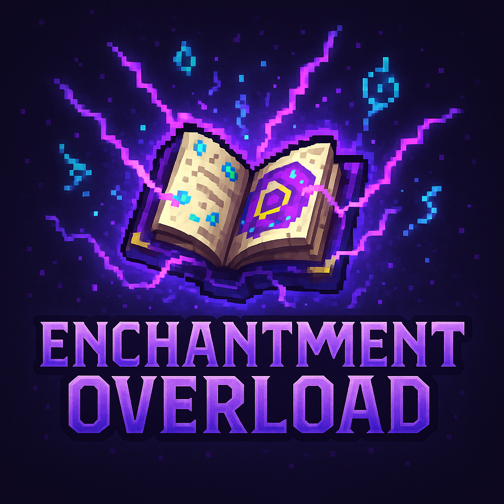

# Enchantment Overload

> Enhancing your Minecraft experience with powerful new enchantments!

## 📖 Overview

Enchantment Overload adds new enchantments to Minecraft, expanding the possibilities for your weapons, tools, and armor. Currently featuring the Life Steal enchantment, with more planned for future updates.

## ✨ Current Features

- **Life Steal Enchantment** – Heals you for a flat amount when dealing damage with an enchanted sword
- **Balanced Gameplay** – Enhances without breaking the vanilla experience
- **Custom Visual Effects** – Heart particles appear when Life Steal activates
- **Advancements** – Unlock advancements for using Life Steal and for killing villagers with it
- **Structure Chest Command** – `/structure-chest <enchantment> <structure>` spawns a loot chest with a Life Steal enchanted book and themed loot (for testing/creative)
- **Compatibility** with most major Minecraft mods

## 🔮 Life Steal Enchantment

| Enchantment | Description                                                       | Max Level | Applies To |
| ----------- | ----------------------------------------------------------------- | --------- | ---------- |
| Life Steal  | Heals the player for a flat amount when dealing damage to enemies | V         | Swords     |

### Life Steal Details:

- **Level I–V:** Heals the attacker for `level × 1.6` health (e.g., Level III = 4.8 hearts) per hit
- **Cooldown:** 250ms between heals per player
- **Visual Effect:** Heart particles appear around the player when Life Steal triggers
- **Advancement:** Unlocks "life_steal" advancement on first use
- **Not compatible with Mending** (balancing mechanic)
- **Note:** Does not heal based on damage dealt, but by a flat amount per hit

## 📥 Installation

1. Download the latest version from [GitHub Releases](https://github.com/awiones/Enchantment-Overload/releases)
2. Make sure you have [Forge](https://files.minecraftforge.net/) installed (Fabric support not implemented)
3. Place the downloaded JAR file in your `mods` folder
4. Launch Minecraft and enjoy!

## ⚙️ Configuration

Configuration options are not currently available in a config file. Life Steal values are hardcoded:

- Max Level: 5
- Heal Amount: `level × 1.6` health per hit
- Cooldown: 250ms

## 🔄 Compatibility

Enchantment Overload is compatible with:

- Forge
- Most other enchantment mods
- Most major content mods

## 🎮 How to Get Life Steal

The Life Steal enchantment can be obtained through:

- Enchantment tables (if added to loot pools)
- Villager trading (if configured)
- Fishing and loot chests (if configured)
- **Creative/Test:** Use `/structure-chest life_steal <structure>` to spawn a chest with a Life Steal enchanted book and themed loot (structures: `stronghold`, `ancient_city`, `mineshaft`)

## 🏆 Advancements

- **Life Steal:** Awarded on first successful heal with Life Steal
- **Traitor of Humanity:** Awarded for killing 50 villagers with a Life Steal sword

## 🐛 Known Issues

- Life Steal may conflict with other health-related mods
- Visual effects may not display with certain shader packs

## 🗺️ Roadmap

- [ ] Add more enchantments (Frostbite, Vampiric, Thunderstrike, etc.)
- [ ] Create custom advancement tree
- [ ] Add enchanted mob variants
- [ ] Implement enchantment-specific quests
- [ ] Create compatibility patches for popular mods

## 💎 Planned Enchantments

We're working on adding these enchantments in future updates:

- Frostbite – Slows enemies and deals additional cold damage
- Thunderstrike – Chance to summon lightning on critical hits
- Venom – Applies a stronger poison effect
- Excavator – Mines in a 3x3 area
- Magnetic – Automatically collects nearby drops
- And many more!

## 🤝 Contributing

Contributions are welcome! Please feel free to submit a Pull Request.

1. Fork the repository
2. Create your feature branch (`git checkout -b feature/amazing-enchantment`)
3. Commit your changes (`git commit -m 'Add some amazing enchantment'`)
4. Push to the branch (`git push origin feature/amazing-enchantment`)
5. Open a Pull Request

## 📜 License

This project is licensed under the MIT License – see the LICENSE file for details.

## 💬 Contact

- GitHub: [awiones](https://github.com/awiones)
- Discord: [Join our Discord server](https://discord.gg/enchantmentoverload)
- CurseForge: [Enchantment Overload](https://www.curseforge.com/minecraft/mc-mods/enchantment-overload)
- Modrinth: [Enchantment Overload](https://modrinth.com/mod/enchantment-overload)

---

Made with ❤️ for the Minecraft community
