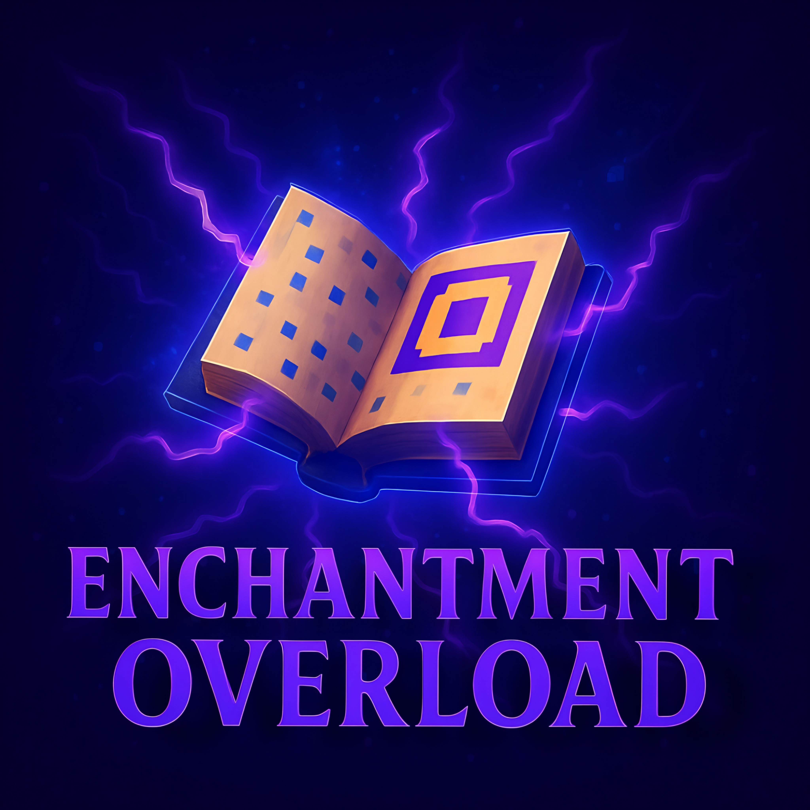

# Enchantment Overload

  

> Enhancing your Minecraft experience with a variety of new enchantments!

## 📖 Overview

Enchantment Overload adds a wide range of enchantments to Minecraft, making survival gameplay more exciting and efficient. Discover new ways to enhance your tools, weapons, and armor.

## ✨ Available Enchantments

| Enchantment                                 | Description                                                            |
| ------------------------------------------- | ---------------------------------------------------------------------- |
| [Life Steal](enchantment/life_steal.md)     | Heals the player for a fixed amount when dealing damage with a weapon. |
| [Arrow Assist](enchantment/arrow_assist.md) | Guides arrows toward the selected target for improved accuracy.        |

## 📥 Installation

1. Download the latest version from [GitHub Releases](https://github.com/awiones/Enchantment-Overload/releases).
2. Ensure you have [Forge](https://files.minecraftforge.net/) installed.
3. Place the mod's JAR file in your `mods` folder.
4. Launch Minecraft and enjoy!

## 🤝 Contributing

Contributions are welcome! Fork the repository, create a feature branch, and submit a Pull Request.

## 📜 License

This project is licensed under the MIT License. See the LICENSE file for details.

## 💬 Contact

- GitHub: [awiones](https://github.com/awiones)
- Discord: [Join our Discord server](https://discord.gg/v9QSTrDQS6)
